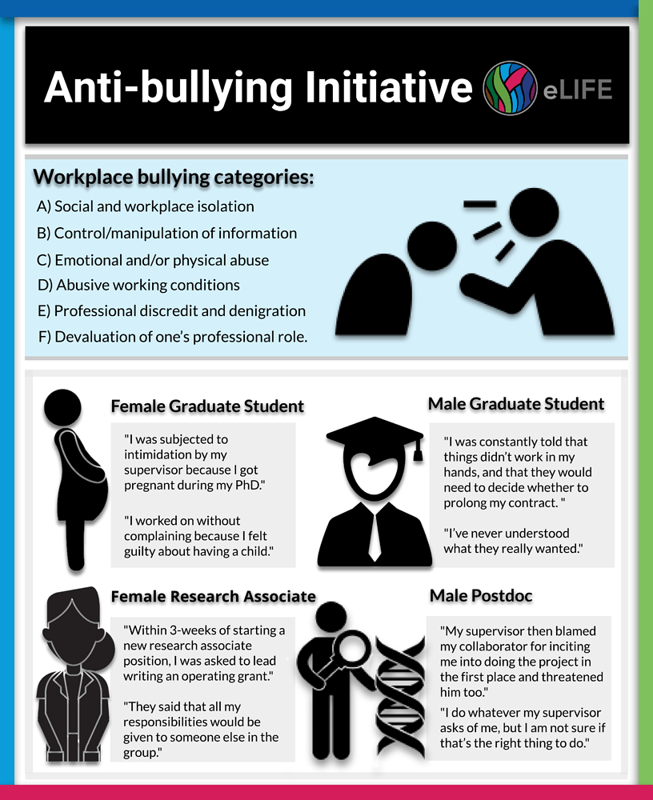

# "My PhD broke me"—bullying in academia and a call to action

Originally published on ecrLife (11/04/2019) https://ecrlife.org/bullying-in-academia-tales-from-victims-and-a-call-to-action/

Workplace bullying—repetitive abusive, threatening, humiliating and intimidating behaviour—is on the rise globally https://www.sciencedirect.com/science/article/pii/S18770428130179 (url). And matters are worse in academia. In the UK, for example, up to 42% of academics report being bullied in the workplace while the national average across all professions ranges from just 10-20%.  

Why do bullies bully? According to researchers from Brock University in Canada the goals of bullying come from internal motivations and desires, which can be conscious or not. Bullying takes many forms: the malicious mistreatment of someone including persistent criticism, inaccurate accusations, exclusion and ostracism, public humiliation, the spreading of rumors, setting people up to fail, or overloading someone with work. Bullying is different from accidental or reactive aggression, since it is goal-directed meaning that the purpose is to harm someone when there is a power imbalance.

While anyone is at risk of being bullied in academia, research has found that some of us are more vulnerable compared to others. For example, early career researchers (ECRs), including trainees (e.g. graduate students, postdocs), minority groups, adjunct professors, research associates, and untenured professors are at a higher risk to experience bullying. Employees with more years in a job report feeling less bullied than others subordinate to them, meaning that junior members of a research group or Faculty may be at greater risk of bullying.

The existence of sharp power differentials is a major factor in workplace bullying in academia

These specific groups are more vulnerable to bullying in academia than others because of the existence of sharp power differentials, a major contributing factor to bullying in the workplace. For example, men and supervisors of large successful research groups are observed to perpetrate bullying behavior more often than women and other minorities, though exceptions do exist. Other research has shown that the pressure associated with publishing, getting research funding, and lack of leadership and people management training in science may also contribute to bullying.

In some cases, principal investigators (PI) can also experience bullying from students, peers, or administrators. Take the example of one PI who was bullied by an administrator for being too ambitious, making her overly conscious of her success. When she moved to another institution, she did not make collaborations with other researchers in different departments, as she had previously, because she did not want to appear to be too ambitious. This is also an example of the long-term impact bullying can have on future work.

To highlight that bullying can take different forms and occur at all career stages, we include here four anonymous testimonials from victims of academic bullying in the life sciences:

I got pregnant during my PhD and I was told it was not an issue. However, during the course of my pregnancy, I was removed from my projects and left out of discussions about the work that needed to be done. When I asked for an explanation, I was told that science could not wait for me while I was pregnant, even though I was eager to work, and the law permitted me to do so. After my child was born, I was made to return to work after just three weeks, while legally I was permitted up to a year off work.

In the lab, I was given bits and pieces of others’ projects and not permitted to work on my own project. I worked without complaining but this took a toll on my emotional health with time. It was after my then-toddler son broke his arm that everything got worse. I needed to take a week off for his hospital stay, but my supervisor called me to his office and told me that I was a useless researcher and that I didn’t belong in science, and then he fired me. I knew it was illegal for him to do so, but I didn’t want to fight him because I was dependent on him to finish my PhD. I met with him after a week and he told me that I could work, but without pay, to make up for the duration of my pregnancy when I was paid. I did as I was told for the next six months, and somehow with the support of my husband and my best friend, was able to graduate and leave. I now have a permanent faculty position at a university in my home country, but my PhD broke me.

International Female PhD Student
After I joined the lab, my supervisors told me that they needed to re-apply for funding, and that they were relying on my results for the application. Unfortunately, they wanted to employ a method that they were unfamiliar with, and as a beginner, I had very limited resources. I managed to get help from someone at another department and it took me three months to set up the method in the lab, but it turned out to be unsuitable for our project. My supervisors were unhappy about this and started blaming me for not smart enough to get the results they expected. I was constantly told that things didn’t work in my hands, and that they would need to decide whether to prolong my contract. This threat was dangled in front of me every few months, and it scared me. I contemplated leaving the lab and moving on, but my supervisors told me that it would look bad for them and offered me another project instead. Things didn’t improve after this either: my project worked fine, but my supervisors continued threatening to terminate my contract.

I decided to graduate after three and a half years of enduring this, but my supervisors then threatened to block me from finishing. I was gas lighted throughout my Master’s and never understood what they really wanted. Why did they offer me a position if I wasn’t good enough? I decided to switch fields after my PhD and am much happier now.

Male Graduate Student Completing His Graduate Studies in His Home Country
Within 3-weeks of starting a new research associate position, I was asked to lead the writing of a grant. The research focus of the group was beyond my experience, and I had little exposure to the research environment of the group. The PI had not established the big picture of the grant; it was left up to me. Furthermore, he provided little to no guidance with writing the grant (e.g. his expectations, what had previously been done, etc.). It was a very overwhelming experience.

When I sent out a draft of the grant, I was pulled into a private meeting with the PI and the co-PI, who both told me that my work was crap and that since I was the highest paid member of the group I should have been producing amazing work. They said that all my responsibilities would be given to someone else in the group. I was given menial tasks like uploading files on the One Drive for several months. Most days, I would not have enough work to do or struggle with the work I was required to do because there was not enough guidance. I have been doing research for 16 years but had never been so bored as I was in this position. A few months later, I was asked to do a few more projects, but again was told my work was not good. The culture in the research group was unforgiving and exclusive.

Outside of the job, through my hard work and determination, I obtained another position and was able to leave. When I sent in my resignation, I was even intimidated to leave earlier than I planned because it would cost them less. I stood my ground and left when I planned to. This job increased my imposter syndrome by a hundred-fold. I was convinced that I was the problem and the dumb one. When I told my husband about the interactions with the PI, he would comment on how ridiculous the situation was. When I was in this situation, it was too hard to see how crappy it was. It’s been about a month since I left, and I feel so much better. I have worked hard to combat my imposter syndrome, and this summer I will begin a tenure track position in a STEM field. In 2019, this is so rare, so I celebrate that!

Female Research Associate in Home Country
I work as a postdoctoral researcher and my supervisor routinely tells us whom we can talk to, eat our lunch or take coffee breaks with. I recently started collaborating on a project with another postdoctoral researcher in the department but only after discussing it with my supervisor and gaining his approval.

We worked on the project part-time for a few months. I approached my supervisor after we had some interesting results, and he suddenly decided that I needed to stop working on it despite the fact that it looked promising. He informed me that he was shocked that I was working on it in the first place and that he didn’t like me to do things behind his back. He also accused me of leaving him out of my activities in the lab. I was also tasked with informing my collaborator, who was livid that we needed to end the project abruptly. However, he understood and let it go, even though it was unfair for him too. My supervisor then blamed my collaborator for inciting me into doing the project in the first place and threatened him too. I do whatever my supervisor asks of me, but I am not sure if that’s the right thing to do. Unfortunately, I feel as though I have no choice since he pays me.

International Male Postdoc
The impacts of bullying are manifold. Studies have reported a long-term health effects in bullying victims, such as anxiety, sleep disorders, chronic fatigue, anger, depression, destabilization of identity, aggression, low self-esteem, loss of confidence, and other health problems. Bullying also has an impact on the institutions where the victims work, including negative work environments, absenteeism, lower engagement, higher turnover, and reduced performance.

Recognizing what bullying looks like is just the first step towards tackling it. Many institutions have opted to use a top-down approach to tackle the problem through policies to report bullying via the human resource office or sometimes an ombudsman. Other institutions may not have specific policies to deal with bullying and often victims are not made aware of existing avenues of recourse. Funding agencies may also choose to get involved, for example after being accused of bullying by her colleagues in 2018 Professor Nazneem Rahman lost 3.5 million GBP in funding from the Wellcome Trust in the UK. In addition to what is currently being done at research institutions and funding agencies, legislation should be put into place by the government to ensure that victims are heard and that there are consequences for the perpetrators.

Apart from institutional actions, bottom-up approaches are also available, such as overcoming the bystander effect. The bystander effect is when individuals are less likely to offer help to a victim when other people are present. Research since the 60s has shown that the presence of other people will inhibit one’s own intention to help and overcoming this effect could be an effective way to mitigate bullying in academia.

A study of whistleblowers found that 71% of employees tend not to directly report wrongdoing as the perceived personal cost is higher than the perceived reward. People tend to feel that personal costs may be higher if reporting happens through face-to-face meetings with authorities. Hence, anonymous reporting channels are needed.

Bullying is an entrenched problem in academia, supported by workplaces with power differentials. Combating bullying is a challenging task at multiple levels and over the next year a group of us eLife Community Ambassadors will embark on an initiative to shine a light on the problem, investigate its root causes and eventually formulate a set of universal measures to tackle bullying in the workplace and give relief to its victims. Stay tuned for more on our progress!
